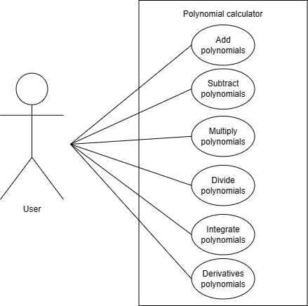
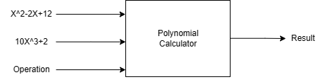
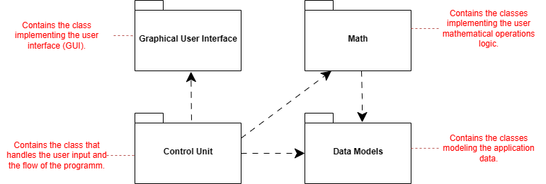
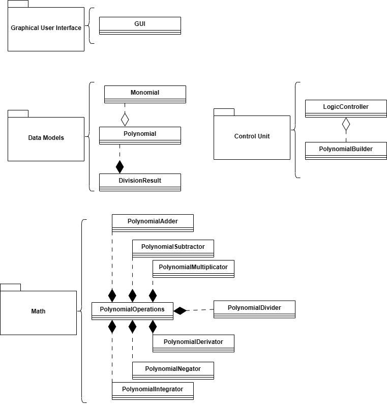
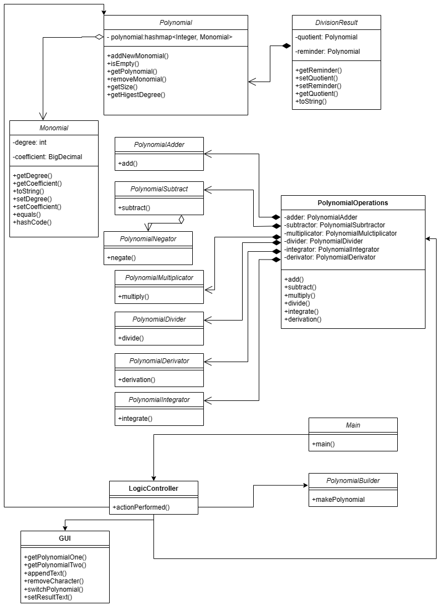
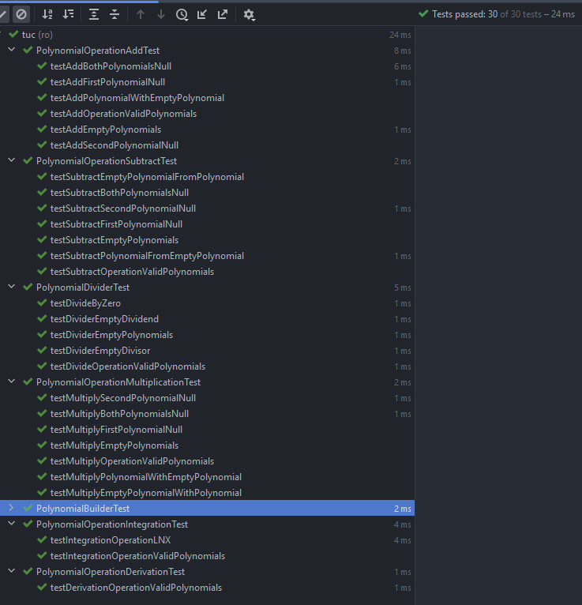

STUDENT NAME: Bălaș Alexandru-Andrei

# CONTENTS 

[1. Assignment Objective ](#assignment-objective)

[2. Problem Analysis, Modeling, Scenarios, Use Cases
](#problem-analysis-modeling-scenarios-use-cases)

[3. Design 3](#design)

[4. Implementation 3](#implementation)

[5. Results 3](#results)

[6. Conclusions 3](#conclusions)

[7. Bibliography 3](#bibliography)

# Assignment Objective

#### The main objective of the assignment is to design and implement a polynomial calculator with a graphical interface in Java, where users can insert polynomials, select mathematical operations, and view the result. 

1.  Analyze the problem and identify requirements.

2.  Design the polynomial calculator.

3.  Implement the polynomial calculator.

4.  Test the polynomial calculator.

# Problem Analysis, Modeling, Scenarios, Use Cases 

### [Use Case]: Add polynomials.

[Primary Actor]: user

[Main Success Scenario]:

1\. The user inserts the 2 polynomials in the graphical user interface.

2\. The user clicks on the "Add" button

3\. The polynomial calculator performs the addition of the two polynomials and displays the result.

### [Use Case]: Subtract polynomials.

[Primary Actor]: user

[Main Success Scenario]:

1\. The user inserts the 2 polynomials in the graphical user interface.

2\. The user clicks on the "Subtract" button

3\. The polynomial calculator performs the subtraction of the two polynomials and displays the result

### [Use Case]: Multiply polynomials.

[Primary Actor]: user

[Main Success Scenario]:

1\. The user inserts the 2 polynomials in the graphical user interface.

2\. The user clicks on the "Multiply" button

3\. The polynomial calculator performs the multiplication of the

two polynomials and displays the result.

# Design

Level 1: Overall system design

Level 2: Division into packages

Level 3: Division into classes

Level 4: Class diagrams: extended view

# Implementation

**[Data Models]**

• The Monomial class is a data model that represents a mathematical
monomial with a specific degree and coefficient. It is initialized with
these values through its constructor and provides access to them through
getter and setter methods. Additionally, the class includes overrides
for the \"equals,\" \"hashCode,\" and \"toString\" methods.

• The Polynomial class represents a polynomial and is composed of a map
of Monomial objects, with the degree of each monomial serving as the map
key. This class offers methods to add or remove monomials, retrieve the
size of the polynomial, check if it is empty, and determine the highest
degree present. It also includes methods to convert the polynomial to a
string representation, for both regular display and integration, which
utilizes the natural logarithm function.

• The DivisionResult class stores the results of polynomial division and
includes two fields: \"quotient\" and \"remainder\", which are both
instances of the Polynomial class. This class provides a convenient way
to store and access the results of polynomial division operations.

The Polynomial class utilizes the Monomial class to represent each term
in the polynomial, and the DivisionResult class uses the Polynomial
class to store both the quotient and remainder of the division
operation. By dividing the logic into these separate classes, each class
is able to focus on its own specific functionality, resulting in a
cleaner and more organized code structure.

**[Math]**

> • The PolynomialOperations class provides a modular and organized
> approach to performing operations on polynomials. By dividing the
> logic into separate helper classes such as PolynomialAdder,
> PolynomialSubtractor, PolynomialMultiplicator, PolynomialDerivator,
> PolynomialIntegrator, and PolynomialDivider, the code is easier to
> read, understand, and maintain. The PolynomialOperations class then
> uses instances of these classes to perform the desired operations and
> return the result.

**[GUI]**

> • The GUI class extends JFrame and incorporates multiple Java Swing
> components. It features text fields for entering two polynomials and
> displaying the result of an operation, as well as radio buttons for
> selecting the active polynomial and buttons for performing operations
> and inputting coefficients. Upon instantiation, the constructor
> initializes the Swing components, sets their properties, and adds them
> to the JFrame. The setTextFieldsAndLabels() method sets up the text
> fields and labels for the polynomials and result, as well as the radio
> buttons for selecting the active polynomial. The setOperationButtons()
> method sets up the buttons for selecting the desired operation to
> perform, while the setLeftHalfButtons() method sets up buttons for
> inputting coefficients for a polynomial. The GUI class works together
> with the LogicController class to execute operations on polynomials.
>
> **[Control Unit]**
>
> •The PolynomialBuilder class is responsible for constructing a
> Polynomial object based on a given input string that follows a
> specific format. The class uses a regular expression pattern to
> identify and extract monomial terms from the input string. It then
> uses a PolynomialAdder object to add the extracted monomials to the
> Polynomial object. The makePolynomial method takes an input string,
> extracts monomials from it, and returns a constructed Polynomial
> object.
>
> • The LogicController class implements ActionListener and KeyListener
> interfaces. Its constructor initializes a GUI object, a
> PolynomialOperations object, and a PolynomialBuilder object. The
> actionPerformed method is triggered when a user interacts with the GUI
> and performs an action. It uses a switch statement to determine which
> button was clicked and calls the corresponding method to perform an
> operation on two polynomials. The methods for adding, subtracting,
> multiplying, dividing, taking derivative, and integrating two
> polynomials are defined in this class.
>
> The addPolynomials, subtractPolynomials, multiplyPolynomials, and
> dividePolynomials methods use the PolynomialBuilder to convert the
> input strings from the GUI into Polynomial objects. They then use the
> PolynomialOperations object to perform the corresponding operation on
> the two polynomials and finally display the result on the GUI.
>
> The derivativePolynomials and integratePolynomials methods use the
> PolynomialBuilder to convert the input strings from the GUI into
> Polynomial objects. They then use the PolynomialOperations object to
> perform the corresponding operation on one polynomial and display the
> result on the GUI. The integratePolynomials method also adds a
> constant C at the end of the integration result.

# Results

# Conclusions

In conclusion, this programming assignment provided me with a valuable opportunity to apply my knowledge of Java and object-oriented programming concepts. Through the process of developing a polynomial calculator, I gained experience in designing user interfaces, implementing basic algorithms, and handling errors and exceptions.

One key takeaway from this assignment was the importance of thorough testing. I tested each logic class with various scenarios to ensure that the program behaved correctly and handled errors appropriately. In addition, I utilized JUnit to perform unit testing, which proved to be a powerful tool for identifying bugs and ensuring code quality.

In terms of future developments, there are several areas in which I could extend the functionality of the polynomial calculator. For example, I could add support for more advanced mathematical operations, such as finding roots or solving differential equations. I could also improve the user interface by adding more intuitive controls or incorporating graphical elements. Overall, this project provided a solid foundation for further exploration and experimentation in the field of software development.

# Bibliography

1.  [Fundamental Programming Techniques
    (dsrl.eu)](https://dsrl.eu/courses/pt/)

2.  [DesingLv1.drawio - diagrams.net](https://app.diagrams.net/)

3.  [Polynomial long division -
    Wikipedia](https://en.wikipedia.org/wiki/Polynomial_long_division)

4.  [Learning programs \| Romania
    (nagarro.com)](https://www.nagarro.com/learning-programs/romania)
